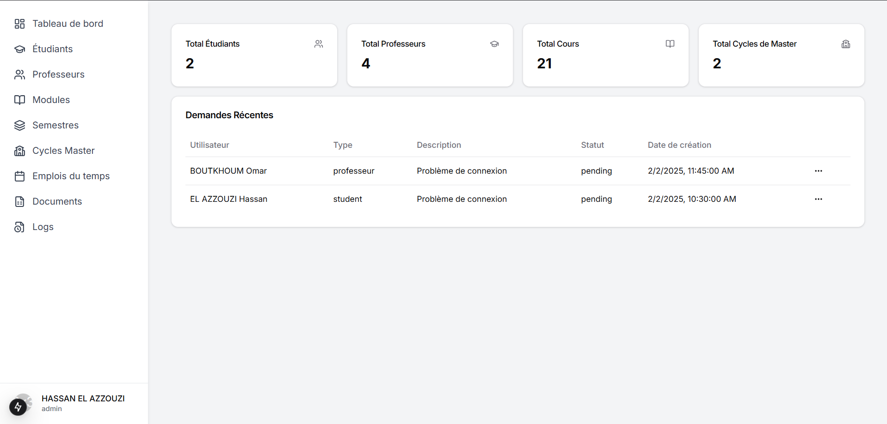
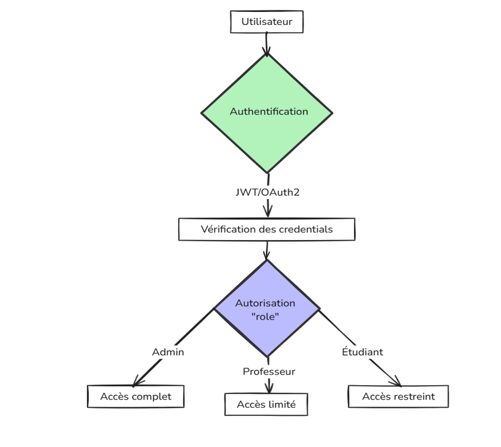

# Application de Gestion des Cycles de Master - WEB


## Introduction
Cette application a été conçue pour faciliter la gestion des cycles de master à la Faculté des Sciences de l'Université Chouaib Doukkali.

Grâce à une architecture moderne et une intégration web et mobile, cette solution vise à améliorer l'organisation et la communication au sein de l’université.

## Table of Contents

- [Introduction](#introduction)
- [Objectifs](#Objectifs)
- [Architecture et Technologies](#Architecturetechnologies)
- [Installation et Exécution](#InstallationetExécution)
- [Authentification et Rôles](#AuthentificationetRôles)
- [Améliorations et Évolutions Futures](#AméliorationsetÉvolutionsFutures)
- [License](#license)

## 🎯 Objectifs
- **Centraliser et automatiser** la gestion des Cycles de Master.
- **Tableau de Board**: Ofrir une tableau de board pour les agents administartifs.
- Assurer une **accessibilité** fluide via une **application** *web* et *mobile*.
- **Sécuriser** l’accès aux données grâce à des *rôles* et *permissions* définis.
- Faciliter la **communication** entre les différents acteurs académiques.
## 🏗 Architecture et Technologies
L’application repose sur une architecture modulaire intégrant plusieurs technologies modernes :

📌 Frontend (Web):
- **Next.js (React)** → Interface web pour l'administration.
- **Chad/ cn + Tailwind CSS** → UI moderne et responsive.
📌 Backend
- **Next js (Node js)** → API REST pour gérer les données.
- **JWT (jose)** → Sécurisation de l’authentification des utilisateurs.
- **Bcrypt.js** → Chiffrement des mots de passe.
📌 Base de données
- **MongoDB (MongoDB Atlas)** → Stockage des données académiques (étudiants, professeurs, modules, etc.).
📌 Déploiement
- **Vercel** → Hébergement du backend + frontend(web).
*Other options: Heroku / AWS*
## ⚙ Installation et Exécution:
**🛠 Prérequis**:
- Node.js (>= 16.x)
- MongoDB (local ou MongoDB Atlas)
- Git
**📥 Cloner le projet**:
backend:
```xml
  SSH : git@github.com:ElazzouziHassan/gestion-web.git
  HTTPS : https://github.com/ElazzouziHassan/gestion-web.git
```
### 🚀 Installation des dépendances:
*📌 Backend*:
```xml
  cd gestion-web
  npm install
```
*Visiter https://ui.shadcn.com/docs/installation/next pour configurer chad/ cn*
### ⚡ Utilisation:

**📌 Lancement du backend**
```xml
  npm run dev
```
L’API + dashboard est accessible sur http://localhost:3000.


## 🔐 Authentification et Rôles:
L'application gère plusieurs niveaux d’accès :



- 👨‍💼 Administrateurs : gestion complète.
- 👨‍🏫 Professeurs : accès aux modules enseignés et list des étudiants...
- 🎓 Étudiants : consultation des emplois du temps et list des modules...

L’authentification se fait via JWT, et chaque utilisateur possède un rôle défini.

## 🚀 Améliorations et Évolutions Futures:

- 🔹 Gestion des examens et des notes.
- 🔹 Suivi des absences et des présences.
- 🔹 Optimisation de l’interface utilisateur (UI/UX).
- 🔹 Intégration avec d’autres systèmes académiques.

## 📜 Licence:
Ce projet est sous licence [Wizardy](LICENSE.md). Vous êtes libre de l’utiliser et de le modifier selon vos besoins.

---

💡 Besoin d’aide ? Contactez-nous à : ezhassan.info@gmail.com 🚀

